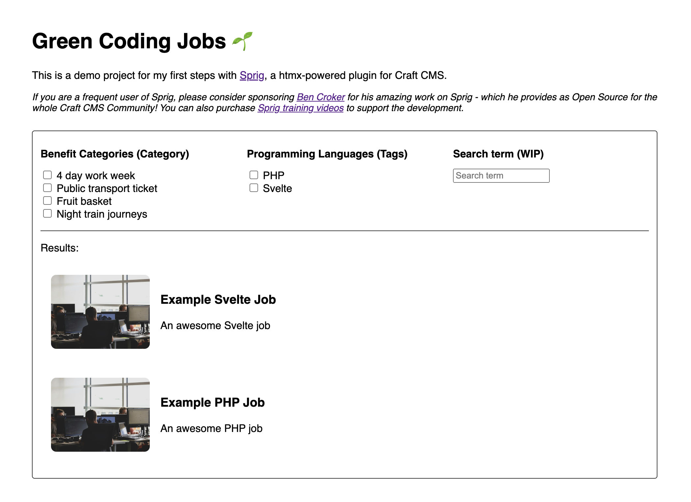

# Craft CMS v5 Green Coding Jobs Demo

[](https://gitpod.io/?autostart=true#DDEV_REPO=https%3A%2F%2Fgithub.com%2Fmandrasch%2Fcraftcms-sprig-green-coding-jobs-demo,DDEV_ARTIFACTS=https%3A%2F%2Fgithub.com%2Fddev%2Fd10simple-artifacts/https://github.com/ddev/ddev-gitpod-launcher/) [](https://codespaces.new/mandrasch/craftcms-sprig-green-coding-jobs-demo)

This is a demo project of my first steps with [Sprig](https://putyourlightson.com/plugins/sprig), a htmx-powered plugin for Craft CMS.



This demo is based on [Sprigboard](https://putyourlightson.com/sprig/videos#sprigboard) and [craftquest.io Reactive Searchable, Filterable Table with Sprig](https://craftquest.io/courses/reactive-searchable-filterable-table-with-sprig) tutorials. Other plugins used (optional): CKEditor, Blitz ($), Imager-X ($).

Status: 🚧 work in progress 🚧 | Codespaces is buggy currently.

<hr>

If you are a frequent user of Sprig, please consider sponsoring [Ben Croker](https://bencroker.com/) for his amazing work on Sprig - which he provides as Open Source for the whole Craft CMS Community! You can also buy [Sprig training videos ($)](https://putyourlightson.com/sprig/training) to support the development.

<hr>

## Local Setup

First time setup after git clone:

```bash
cd craftcms-sprig-green-coding-jobs-demo/
ddev start
ddev composer install

# Import example database dump
ddev import-db --file=dump.sql.gz

# Copy example image
ddev exec 'cp rivage-Fa9b57hffnM-unsplash.jpg web/uploads/rivage-Fa9b57hffnM-unsplash.jpg'

# Open site in browser
ddev launch
```

Afterwards you can just use

```bash
ddev start && ddev launch
```

to begin with the development. Access admin dashboard via `ddev launch /admin`:

- User: admin
- Password: greenweb

https://craft5-green-coding-jobs.ddev.site/admin

## Clear caches (including Blitz)

```
ddev craft clear-caches/all
```

You can check the end of HTML output for state of caching.

## Simulate production enviroment

- switch to `ENVIRONMENT=production` in `.env`

## After git pull

Check if there are project config changes with `ddev craft project-config/diff`, use `ddev craft project-config/apply` to execute them. See: https://craftcms.com/docs/5.x/system/project-config.html

## How was this created?

1. Followed [DDEV quickstart for Craft CMS](https://ddev.readthedocs.io/en/stable/users/quickstart/#craft-cms),
   installation via

```bash
ddev craft install/craft \
    --username="admin" \
    --password="greenweb" \
    --email="admin@example.com" \
    --site-name="Testsite" \
    --language="en" \
    --site-url='$DDEV_PRIMARY_URL'
```

2. Installed Sprig via https://plugins.craftcms.com/sprig?craft5, use DDEV command: `ddev composer require "putyourlightson/craft-sprig:^3.0.1" -w && ddev exec php craft plugin/install sprig`
3. Added Channel "Jobs"
4. Installed Sprig plugin
5. Installed Imager-X plugin for Image optimization (optional), added named transforms
6. Installed Blitz Cache plugin, added `config/blitz.php` (enabled cache for production) and activate caching via `includedUriPatterns` setting
7. Installed CKEditor plugin
8. Added demo content
9. Save db dump export as example in git, `ddev export-db --file=dump.sql.gz`

## TODOs

- [ ] Add URL params!
- [ ] Add dropdown example (https://putyourlightson.com/sprig/videos#sprigboard)
- [ ] Loading animation?
- [ ] How could we cache frequent search queries?

## Further resources

- https://putyourlightson.com/sprig/videos#sprigboard
- https://craftsnippets.com/articles/building-reactive-craft-commerce-product-page-with-sprig-plugin
- dotall 2023 sprig talk
- https://craftquest.io/courses/commerce-product-filtering-with-sprig/34452
- https://www.youtube.com/watch?v=DJqdF7kYgjE
- Another demo with Sprig: https://c4d.space/
- Advanced Product Filtering with Sprig
- Sprig Cookbook / Videos
- CraftQuest Courses - Sprig
